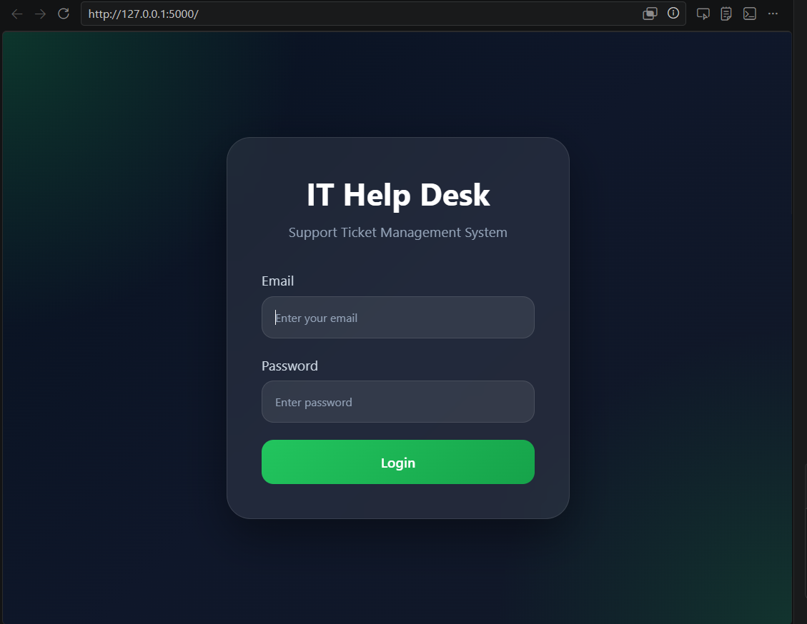
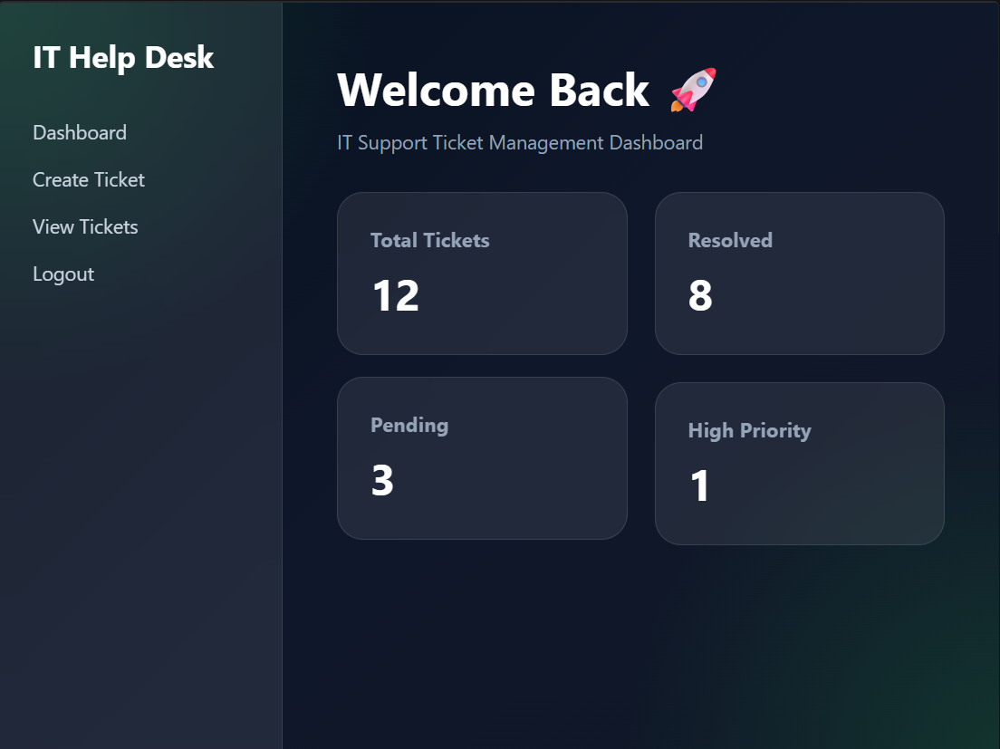
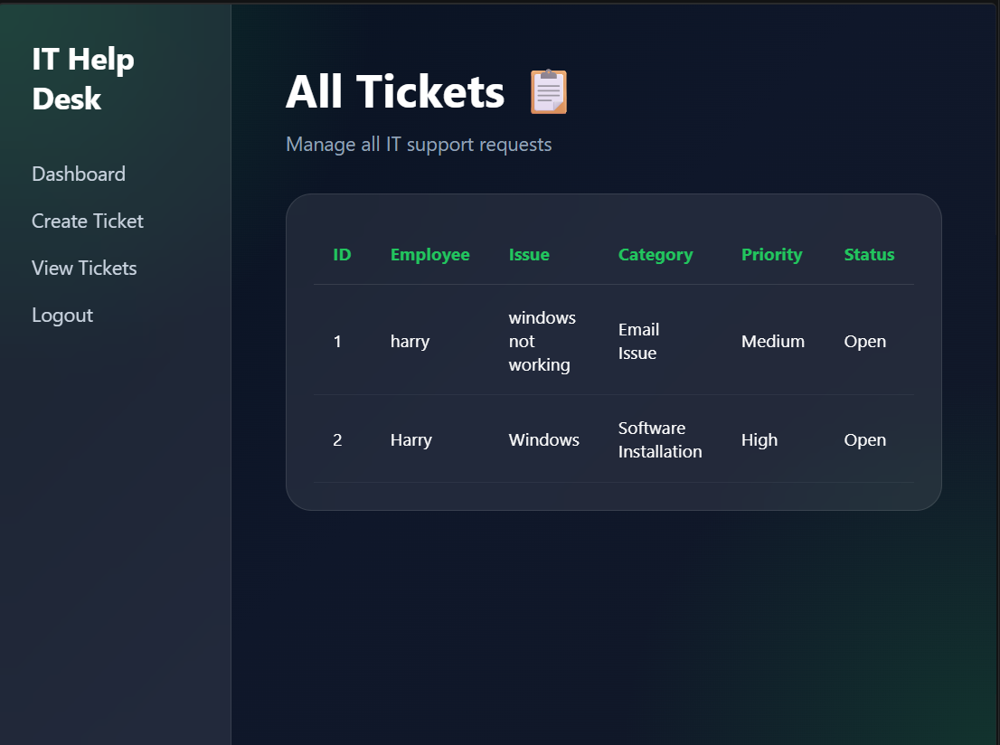

# 🎫 IT Help Desk Ticketing System

A modern **IT Help Desk Ticketing System** built using **Python Flask, HTML, CSS, JavaScript, and SQLite**. This project simulates a real-world IT support environment where users can log in, create support tickets, and manage IT-related requests.

---

## 🚀 Features

### 🔐 Login System

* Secure login authentication
* Session-based access control
* Protected routes

### 📊 Dashboard

* Modern premium UI
* Ticket overview dashboard
* Navigation sidebar

### 🎫 Create Ticket

Users can submit IT support requests including:

* Employee Name
* Issue Title
* Category Selection
* Priority Level
* Issue Description

### 📋 Ticket Management

* View all submitted tickets
* Track support requests
* Ticket status management
* Organized support workflow

### 💾 Database Integration

* SQLite database
* Ticket storage
* Persistent records

---

## 🛠️ Tech Stack

### Frontend

* HTML5
* CSS3
* JavaScript

### Backend

* Python
* Flask

### Database

* SQLite

---

## 📸 Project Preview

### 🔐 Login Page



Secure login page with authentication system.

---

### 📊 Dashboard



Modern dashboard displaying ticket system overview.

---

### 🎫 Create Ticket


Submit IT support requests with categories and priorities.

---

### 📋 View Tickets



Manage and view all submitted support tickets.

---

## 📂 Project Structure

```txt
IT-HelpDesk-System/
│
├── app.py
├── helpdesk.db
│
├── templates/
│   ├── login.html
│   ├── dashboard.html
│   ├── create_ticket.html
│   └── tickets.html
│
├── static/
│   ├── style.css
│   └── script.js
│
├── screenshots/
│   ├── login.png
│   ├── dashboard.png
│   ├── create.png
│   └── view.png
│
└── README.md
```

---

## ⚙️ Installation & Setup

### Clone Repository

```bash
git clone https://github.com/Angad198/IT-HelpDesk-System.git
```

### Navigate to Project Folder

```bash
cd IT-HelpDesk-System
```

### Install Flask

```bash
pip install flask
```

### Run Application

```bash
python app.py
```

---

## 🔑 Demo Login Credentials

```txt
Email: admin@helpdesk.com
Password: admin123
```

---

## 🎯 Project Purpose

This project was built to demonstrate:

* IT Support workflow understanding
* Help Desk ticketing concepts
* Flask backend development
* Database integration using SQLite
* Frontend UI development
* Real-world problem-solving

---

## 🔮 Future Improvements

* Role-based authentication
* Ticket search & filtering
* Email notifications
* Admin analytics dashboard
* Ticket status updates
* Cloud database integration

---

## 👨‍💻 Author

**Angaddeep Singh**
IT Support | Help Desk | Cybersecurity Enthusiast

GitHub: https://github.com/Angad198
